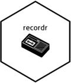

<!-- README.md is generated from README.Rmd. Please edit that file -->
recorder 
===================================================================

[](https://travis-ci.org/smaakage85/recorder) [](https://CRAN.R-project.org/package=recorder) [](https://CRAN.R-project.org/package=recorder)

`recorder` is a lightweight toolkit to validate new observations when computing their corresponding predictions with a predictive model.

With `recorder` the validation process consists of two steps:

1.  record relevant statistics and meta data of the variables in the original training data for the predictive model
2.  use these data to run a set of basic validation tests on the new set of observations.

Motivation
----------

There can be many data specific reasons, why you might not be confident in the predictions of a predictive model on new data.

Some of them are obvious, e.g.:

-   One or more variables in training data are not found in new data
-   The class of a given variable differs in training data and new data

Others are more subtle, for instance if it is the case, that observations in new data are not within the "span" of the training data.

If one or more of the `recorder` validation tests fail on new data, you might not be confident in the corresponding predictions.

Installation
------------

`recorder` can be installed from CRAN with `install.packages('recorder')`. If you want the development version then install directly from GitHub:

``` r
devtools::install_github("smaakage85/recorder")
```

Workflow Example
----------------

Get ready by loading the package.

``` r
library(recorder)
```

The famous `iris` dataset will be used as an example. The data set is divided into training data, that can be used for model development, and new data for predictions after modelling, which can be validated with `recorder`.

``` r
set.seed(1)
trn_idx <- sample(seq_len(nrow(iris)), 100)
data_training <- iris[trn_idx, ]
data_new <- iris[-trn_idx, ]
```

Record statistics and meta data of the training data with `record()`.

``` r
tape <- record(data_training)
#> 
#> [RECORD]
#> 
#> ... recording meta data and statistics of 100 rows with 5 columns... 
#> 
#> [STOP]
```

Run validation tests on new data with `play()`.

``` r
playback <- play(tape, data_new)
#> 
#> [PLAY]
#> 
#> ... playing data.tape on new data with 50 rows with 5 columns ...
#> 
#> [STOP]
```

Print the over-all results of the validation tests.

``` r
playback
#> 
#> [PLAY]
#> 
#> # of rows in new data: 50
#> # of rows passing all tests: 49
#> # of rows failing one or more tests: 1
#> 
#> Test results (failures):
#> > 'missing_variable': no failures
#> > 'mismatch_class': no failures
#> > 'mismatch_levels': no failures
#> > 'new_variable': no failures
#> > 'outside_range': Petal.Length[row(s): #11]
#> > 'new_level': no failures
#> > 'new_NA': no failures
#> > 'new_text': no failures
#> 
#> Test descriptions:
#> 'missing_variable': variable observed in training data but missing in new data
#> 'mismatch_class': 'class' in new data does not match 'class' in training data
#> 'mismatch_levels': 'levels' in new data and training data are not identical
#> 'new_variable': variable observed in new data but not in training data
#> 'outside_range': value in new data outside recorded range in training data
#> 'new_level': new 'level' in new data compared to training data
#> 'new_NA': NA observed in new data but not in training data
#> 'new_text': new text in new data compared to training data
#> 
#> [STOP]
```

The test summary tells us, that one observation (row \#11) has a value of the variable "Petal.Length" outside the recorded range in the training data; hence we might not be confident in the prediction of this particular observation.

After running the validation tests, you can extract the results of (any) failed tests for the rows/observations of new data with `get_failed_tests()`.

``` r
failed_tests <- get_failed_tests(playback)
# print.
library(knitr)
kable(head(failed_tests, 15))
```

| outside\_range.Petal.Length |
|:----------------------------|
| FALSE                       |
| FALSE                       |
| FALSE                       |
| FALSE                       |
| FALSE                       |
| FALSE                       |
| FALSE                       |
| FALSE                       |
| FALSE                       |
| FALSE                       |
| TRUE                        |
| FALSE                       |
| FALSE                       |
| FALSE                       |
| FALSE                       |

You might also find the functions `get_failed_tests_string()` and `get_clean_rows()` to be useful.

That is basically it. If you to know more about all of the exciting features of `recorder`, take a look at the vignette.

Also, if you have any feedback on the package, please let me hear from you.
