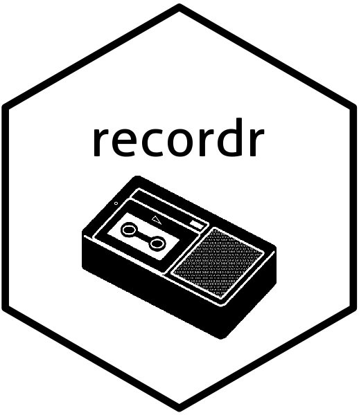

<!-- README.md is generated from README.Rmd. Please edit that file -->
recordr 
============================================================

[](https://travis-ci.org/smaakage85/recordr)

`recordr` is a lightweight toolkit to check and validate new observations before computing their predictions with a machine learning model. The validation process consists of two steps:

1.  estimate/record relevant parameters and metadata from the training data set for a machine learning model
2.  run a number of basic tests on a new set of observations using the recorded parameters.

Installation
------------

`recordr` can be installed from CRAN with `install.packages('recordr')`. If you want the development version then install directly from GitHub:

``` r
devtools::install_github("smaakage85/recordr")
```

BLA BLA
-------

.. BLA ...

For more details on how to use `recordr` please take a look at the package vignette.
